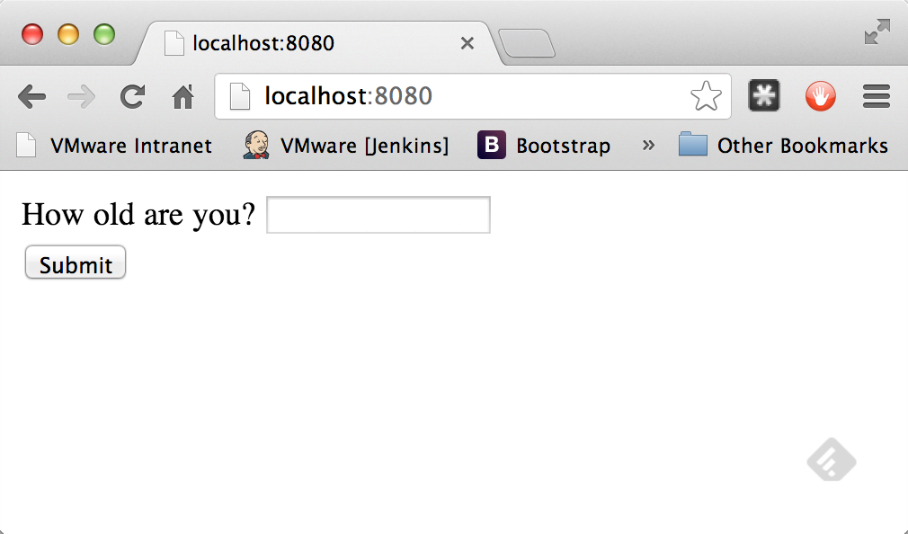
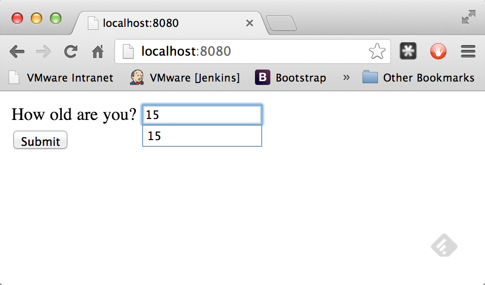
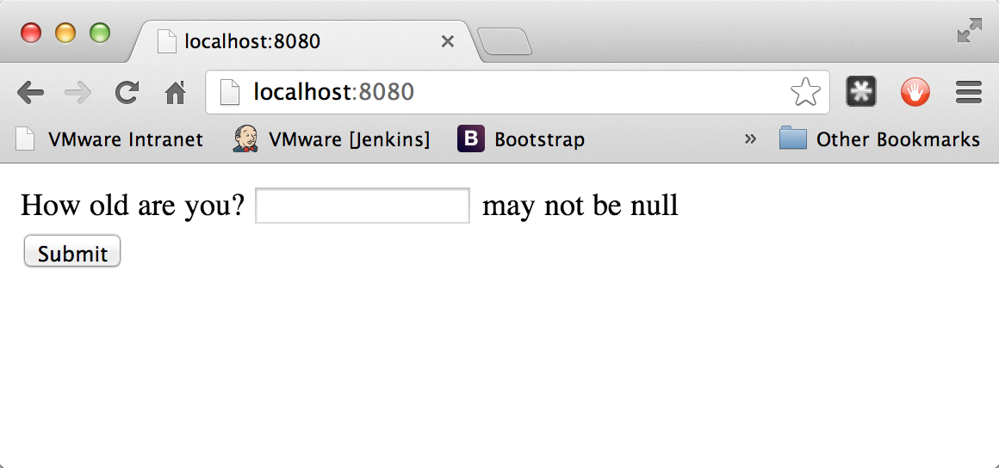
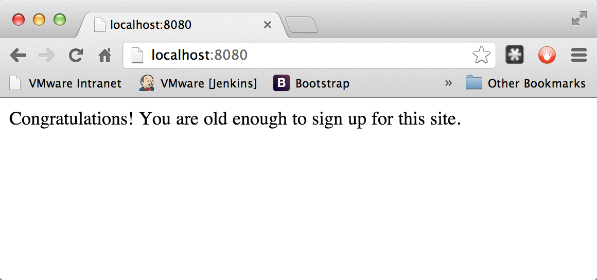

:toc:
:icons: font
:source-highlighter: prettify
:project_id: gs-validating-form-input
This guide walks you through the process of configuring a web application form to support validation.

== What you'll build

You'll build a simple Spring MVC application that take user input and checks the input using standard validation annotations. You'll also see how to display the error message on the screen so the user can re-enter a valid input.

== What you'll need

:java_version: 1.8
include::https://raw.githubusercontent.com/spring-guides/getting-started-macros/master/prereq_editor_jdk_buildtools.adoc[]

include::https://raw.githubusercontent.com/spring-guides/getting-started-macros/master/how_to_complete_this_guide.adoc[]

include::https://raw.githubusercontent.com/spring-guides/getting-started-macros/master/hide-show-gradle.adoc[]

include::https://raw.githubusercontent.com/spring-guides/getting-started-macros/master/hide-show-maven.adoc[]

include::https://raw.githubusercontent.com/spring-guides/getting-started-macros/master/hide-show-sts.adoc[]

[[initial]]
== Create a PersonForm object
The application involves validating a user's name and age, so first you need to create a class to back the form to create a person.

`src/main/java/hello/PersonForm.java`
[source,java]
----
include::complete/src/main/java/hello/PersonForm.java[]
----

The `PersonForm` class has two attributes: `name` and `age`. It is flagged with several standard validation annotations:

- `@Size(min=2, max=30)` will only allow names between 2 and 30 characters long
- `@NotNull` won't allow a null value, which is what Spring MVC generates if the entry is empty
- `@Min(18)` won't allow if the age is less than 18

In addition to that, you can also see getters/setters for `name` and `age` as well as a convenient `toString()` method.

== Create a web controller
Now that you have defined a form backing object, it's time to create a simple web controller.

`src/main/java/hello/WebController.java`
[source,java]
----
include::complete/src/main/java/hello/WebController.java[]
----

This controller has a GET and a POST method, both mapped to `/`.

The `showForm` method returns the `form` template. It includes a `PersonForm` in its method signature so the template can associate form attributes with a `PersonForm`.

The `checkPersonFormInfo` method accepts two arguments:

- A `person` object marked up with `@Valid` to gather the attributes filled out in the form you're about to build.
- A `bindingResult` object so you can test for and retrieve validation errors.

You can retrieve all the attributes from the form bound to the `PersonForm` object. In the code, you test for errors, and if so, send the user back to the original `form` template. In that situation, all the error attributes are displayed.

If all of the person's attribute are valid, then it redirects the browser to the final `results` template.

== Build an HTML front end
Now you build the "main" page.

`src/main/resources/templates/form.html`
[source,html]
----
include::complete/src/main/resources/templates/form.html[]
----

The page contains a simple form with each field in a separate slot of a table. The form is geared to post towards `/`. It is marked as being backed up by the `person` object that you saw in the GET method in the web controller. This is known as a **bean-backed form**. There are two fields in the `PersonForm` bean, and you can see them tagged `th:field="*{name}"` and `th:field="*{age}"`. Next to each field is a secondary element used to show any validation errors.

Finally, you have a button to submit. In general, if the user enters a name or age that violates the `@Valid` constraints, it will bounce back to this page with the error message on display. If a valid name and age is entered, the user is routed to the next web page.

`src/main/resources/templates/results.html`
[source,html]
----
include::complete/src/main/resources/templates/results.html[]
----

NOTE: In this simple example, these web pages don't have any sophisticated CSS or JavaScript. But for any production web site, it's valuable to learn how to style your web pages.

== Create an Application class
For this application, you are using the template language of http://www.thymeleaf.org/doc/html/Thymeleaf-Spring3.html[Thymeleaf]. This application needs more than raw HTML.

`src/main/java/hello/Application.java`
[source,java]
----
include::complete/src/main/java/hello/Application.java[]
----

To activate Spring MVC, you would normally add `@EnableWebMvc` to the `Application` class. But Spring Boot's `@SpringBootApplication` already adds this annotation when it detects **spring-webmvc** on your classpath. This same annotation allows it to find the annotated `@Controller` class and its methods.

The Thymeleaf configuration is also taken care of by `@SpringBootApplication`: by default templates are located in the classpath under `templates/` and are resolved as views by stripping the '.html' suffix off the file name. Thymeleaf settings can be changed and overridden in a variety of ways depending on what you need to achieve, but the details are not relevant to this guide.

include::https://raw.githubusercontent.com/spring-guides/getting-started-macros/master/build_an_executable_jar_subhead.adoc[]

include::https://raw.githubusercontent.com/spring-guides/getting-started-macros/master/build_an_executable_jar_with_both.adoc[]

The application should be up and running within a few seconds.

If you visit http://localhost:8080/, you should see something like this:

What happens if you enter **A** for the name and **15** for your age and click on **Submit**?

image::images/valid-03.png[]

Here you can see that because it violated the constraints in the `PersonForm` class, you get bounced back to the "main" page. If you click on Submit with nothing in the entry box, you get a different error.

If you enter a valid name and age, you end up on the `results` page!

== Summary

Congratulations! You have coded a simple web application with validation built into a domain object. This way you can ensure the data meets certain criteria and that the user inputs it correctly.

include::https://raw.githubusercontent.com/spring-guides/getting-started-macros/master/footer.adoc[]

